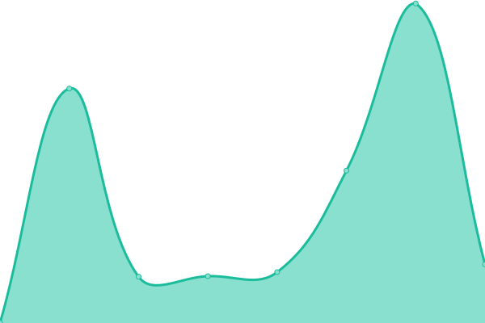
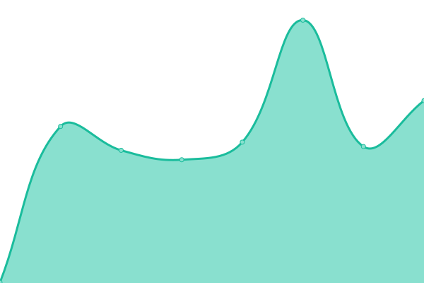
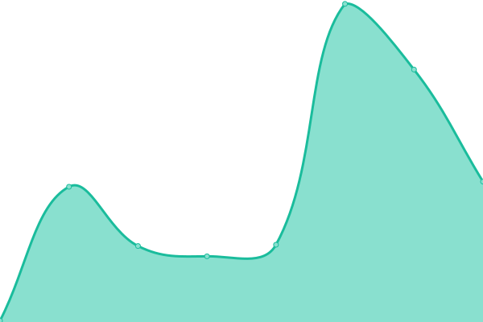
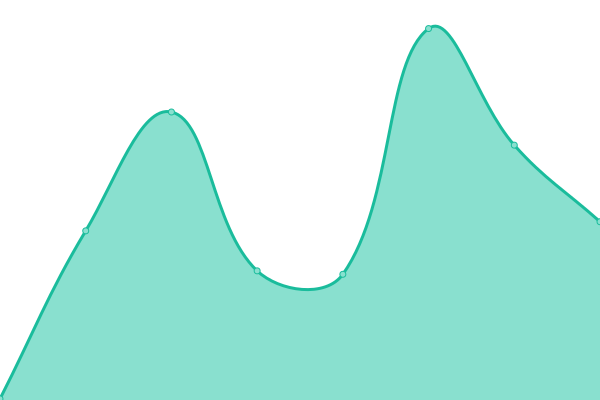
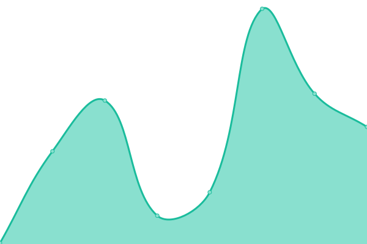
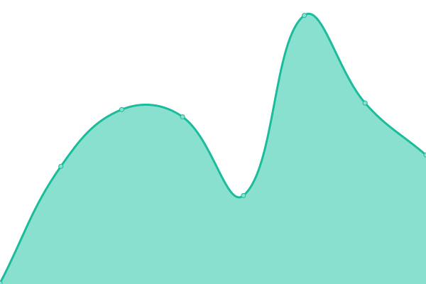

# [📈 Live Status](https://status.nuvetoapps.com.br): <!--live status--> **🟧 Partial outage**

This repository contains the open-source uptime monitor and status page for [Nuveto Labs](https://status.nuvetoapps.com.br), powered by [Upptime](https://github.com/upptime/upptime).

With [Upptime](https://upptime.js.org), you can get your own unlimited and free uptime monitor and status page, powered entirely by a GitHub repository. We use [Issues](https://github.com/Nuveto-Labs/upptime/issues) as incident reports, [Actions](https://github.com/Nuveto-Labs/upptime/actions) as uptime monitors, and [Pages](https://status.nuvetoapps.com.br) for the status page.

<!--start: status pages-->
<!-- This summary is generated by Upptime (https://github.com/upptime/upptime) -->
<!-- Do not edit this manually, your changes will be overwritten -->
<!-- prettier-ignore -->
| URL | Status | History | Response Time | Uptime |
| --- | ------ | ------- | ------------- | ------ |
|  Inference VIP | 🟩 Up | [inference-vip.yml](https://github.com/Nuveto-Labs/uptime/commits/HEAD/history/inference-vip.yml) | 

 768ms
     
 | 

<a href="https://status.nuvetoapps.com.br/history/inference-vip">100.00%</a>
    

|  Portal Cultura | 🟩 Up | [portal-cultura.yml](https://github.com/Nuveto-Labs/uptime/commits/HEAD/history/portal-cultura.yml) | 

 269ms
     
 | 

<a href="https://status.nuvetoapps.com.br/history/portal-cultura">99.54%</a>
    

|  Portal Suzano | 🟩 Up | [portal-suzano.yml](https://github.com/Nuveto-Labs/uptime/commits/HEAD/history/portal-suzano.yml) | 

 297ms
     
 | 

<a href="https://status.nuvetoapps.com.br/history/portal-suzano">100.00%</a>
    

|  Portal Vip | 🟩 Up | [portal-vip.yml](https://github.com/Nuveto-Labs/uptime/commits/HEAD/history/portal-vip.yml) | 

 1721ms
     
 | 

<a href="https://status.nuvetoapps.com.br/history/portal-vip">99.69%</a>
    

|  Sigma Banco W | 🟩 Up | [sigma-banco-w.yml](https://github.com/Nuveto-Labs/uptime/commits/HEAD/history/sigma-banco-w.yml) | 

 310ms
     
 | 

<a href="https://status.nuvetoapps.com.br/history/sigma-banco-w">100.00%</a>
    

|  Sigma Cardif | 🟩 Up | [sigma-cardif.yml](https://github.com/Nuveto-Labs/uptime/commits/HEAD/history/sigma-cardif.yml) | 

 705ms
     
 | 

<a href="https://status.nuvetoapps.com.br/history/sigma-cardif">100.00%</a>
    

|  Sigma Colfondos | 🟩 Up | [sigma-colfondos.yml](https://github.com/Nuveto-Labs/uptime/commits/HEAD/history/sigma-colfondos.yml) | 

 265ms
     
 | 

<a href="https://status.nuvetoapps.com.br/history/sigma-colfondos">100.00%</a>
    

|  Sigma Demo | 🟩 Up | [sigma-demo.yml](https://github.com/Nuveto-Labs/uptime/commits/HEAD/history/sigma-demo.yml) | 

 743ms
     
 | 

<a href="https://status.nuvetoapps.com.br/history/sigma-demo">100.00%</a>
    

|  Sigma Dentalia | 🟩 Up | [sigma-dentalia.yml](https://github.com/Nuveto-Labs/uptime/commits/HEAD/history/sigma-dentalia.yml) | 

 266ms
     
 | 

<a href="https://status.nuvetoapps.com.br/history/sigma-dentalia">100.00%</a>
    

|  Sigma Flash Mobile | 🟩 Up | [sigma-flash-mobile.yml](https://github.com/Nuveto-Labs/uptime/commits/HEAD/history/sigma-flash-mobile.yml) | 

 269ms
     
 | 

<a href="https://status.nuvetoapps.com.br/history/sigma-flash-mobile">100.00%</a>
    

|  Sigma Fonafe | 🟩 Up | [sigma-fonafe.yml](https://github.com/Nuveto-Labs/uptime/commits/HEAD/history/sigma-fonafe.yml) | 

 371ms
     
 | 

<a href="https://status.nuvetoapps.com.br/history/sigma-fonafe">100.00%</a>
    

|  Sigma Lab | 🟩 Up | [sigma-lab.yml](https://github.com/Nuveto-Labs/uptime/commits/HEAD/history/sigma-lab.yml) | 

 696ms
     
 | 

<a href="https://status.nuvetoapps.com.br/history/sigma-lab">100.00%</a>
    

|  Sigma LAP | 🟩 Up | [sigma-lap.yml](https://github.com/Nuveto-Labs/uptime/commits/HEAD/history/sigma-lap.yml) | 

 232ms
     
 | 

<a href="https://status.nuvetoapps.com.br/history/sigma-lap">100.00%</a>
    

|  Sigma Melitta | 🟩 Up | [sigma-melitta.yml](https://github.com/Nuveto-Labs/uptime/commits/HEAD/history/sigma-melitta.yml) | 

 681ms
     
 | 

<a href="https://status.nuvetoapps.com.br/history/sigma-melitta">100.00%</a>
    

|  Sigma Nassau | 🟩 Up | [sigma-nassau.yml](https://github.com/Nuveto-Labs/uptime/commits/HEAD/history/sigma-nassau.yml) | 

 248ms
     
 | 

<a href="https://status.nuvetoapps.com.br/history/sigma-nassau">100.00%</a>
    

|  Sigma Timac Agro | 🟩 Up | [sigma-timac-agro.yml](https://github.com/Nuveto-Labs/uptime/commits/HEAD/history/sigma-timac-agro.yml) | 

 662ms
     
 | 

<a href="https://status.nuvetoapps.com.br/history/sigma-timac-agro">100.00%</a>
    

|  Sigma Unimed | 🟩 Up | [sigma-unimed.yml](https://github.com/Nuveto-Labs/uptime/commits/HEAD/history/sigma-unimed.yml) | 

 232ms
     
 | 

<a href="https://status.nuvetoapps.com.br/history/sigma-unimed">100.00%</a>
    

|  Sigma Vcimentos | 🟩 Up | [sigma-vcimentos.yml](https://github.com/Nuveto-Labs/uptime/commits/HEAD/history/sigma-vcimentos.yml) | 

 212ms
     
 | 

<a href="https://status.nuvetoapps.com.br/history/sigma-vcimentos">100.00%</a>
    

|  Sigma Vip | 🟩 Up | [sigma-vip.yml](https://github.com/Nuveto-Labs/uptime/commits/HEAD/history/sigma-vip.yml) | 

 641ms
     
 | 

<a href="https://status.nuvetoapps.com.br/history/sigma-vip">100.00%</a>
    

|  Voraki Demo | 🟥 Down | [voraki-demo.yml](https://github.com/Nuveto-Labs/uptime/commits/HEAD/history/voraki-demo.yml) | 

 88ms
     
 | 

<a href="https://status.nuvetoapps.com.br/history/voraki-demo">0.00%</a>
    

|  Voraki Lab | 🟩 Up | [voraki-lab.yml](https://github.com/Nuveto-Labs/uptime/commits/HEAD/history/voraki-lab.yml) | 

 655ms
     
 | 

<a href="https://status.nuvetoapps.com.br/history/voraki-lab">100.00%</a>
    

|  Voraki Madeira Madeira | 🟥 Down | [voraki-madeira-madeira.yml](https://github.com/Nuveto-Labs/uptime/commits/HEAD/history/voraki-madeira-madeira.yml) | 

 0ms
     
 | 

<a href="https://status.nuvetoapps.com.br/history/voraki-madeira-madeira">0.00%</a>
    

|  Voraki SumUp | 🟥 Down | [voraki-sum-up.yml](https://github.com/Nuveto-Labs/uptime/commits/HEAD/history/voraki-sum-up.yml) | 

 0ms
     
 | 

<a href="https://status.nuvetoapps.com.br/history/voraki-sum-up">0.00%</a>
    

<!--end: status pages-->

[**Visit our status website →**](https://status.nuvetoapps.com.br)

## 📄 License

- Powered by: [Upptime](https://github.com/upptime/upptime)
- Code: [MIT](./LICENSE) © [Nuveto Labs](https://status.nuvetoapps.com.br)
- Data in the `./history` directory: [Open Database License](https://opendatacommons.org/licenses/odbl/1-0/)
